# EFM : Eclipse Formal Modeling

Thanks for your interest in this project.

# Using Gerrit, you can contribute to the Eclipse Formal Modeling project, even if you aren't a committer.

## Sign in the eclipse development chart

*Create an Eclipse Bugzilla account : https://dev.eclipse.org/site_login/createaccount.php
This step is your average account creation, and it will require you to visit a mail sent URL to validate the account.
*Sign the CLA :  https://wiki.eclipse.org/CLA
This can be done ( by visitiing the following link: https://projects.eclipse.org/user/login/sso ) once logged in by clicking on Contributor License Agreement and following all the instruction on this same page.
*Activate your Gerrit account : https://git.eclipse.org/r/
The id and password , just as your sign-in information on the eclipse website, are the mail address you used to create the eclipse account and the associated password, no need to create a new one.

## Retrieve Eclipse Formal Modeling code

To retrieve the efm-modeling code:

* via git : git://git.eclipse.org/gitroot/gerrit/efm/org.eclipse.efm-modeling.git
* via ssh : ssh://git.eclipse.org/gitroot/gerrit/efm/org.eclipse.efm-modeling.git
* via http : http://git.eclipse.org/gitroot/gerrit/efm/org.eclipse.efm-modeling.git

### Configure access via EGit

First, you will have to clone the Git repository in your Eclipse IDE.

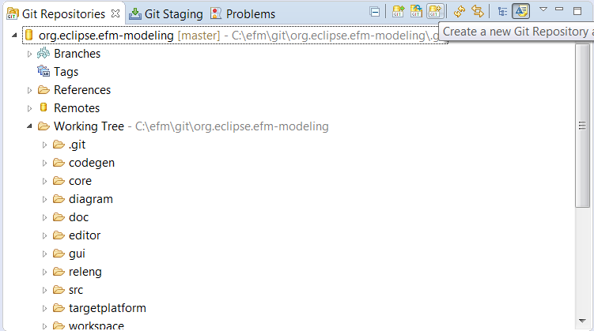

Copy to the clipboard the selected git URI, e.g.
`git://git.eclipse.org/gitroot/gerrit/efm/org.eclipse.efm-modeling.git`,
and open pen the Git Clone repository dialog.

As you can see, you have access to a number of protocols to import the Git repository. Select the protocol you prefer and enter the corresponding address (not need because its was in your clipboard).

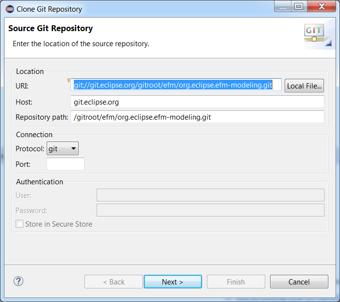

You then have to select the branches you want to import.

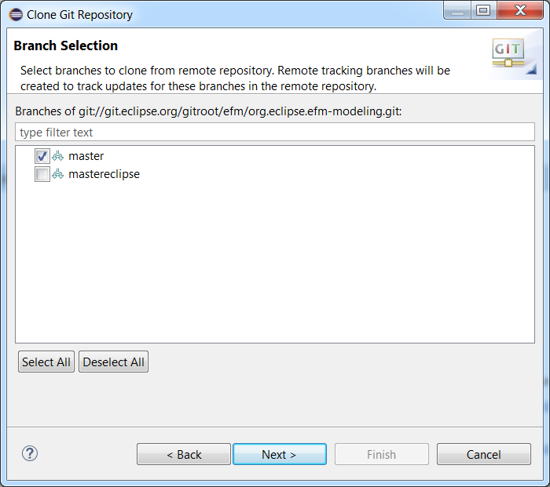

  

To allow the user to commit anything Git will have to know your id and email. As such you can enter those variables in <b>Preferences>Team>Git>Configuration</b> and add the two entries:
* key: <b>user.name</b> / value: <b>[your name]</b>
* key: <b>user.email</b> / value: <b>[your email]</b>

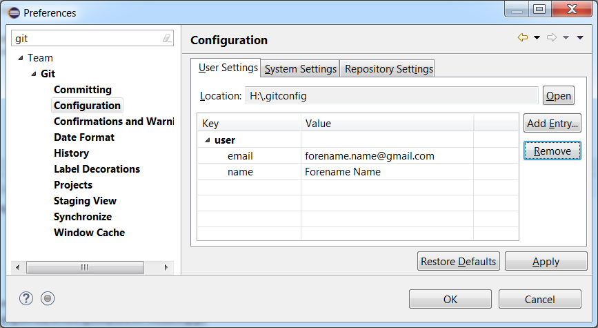

  

If you do not have an ssh key yet, you can generate one using Eclipse via menu `Window/Preferences` in section `General/Network Connections/SSH2` in the `Key Management` tab. Select **Generate RSA key...**.

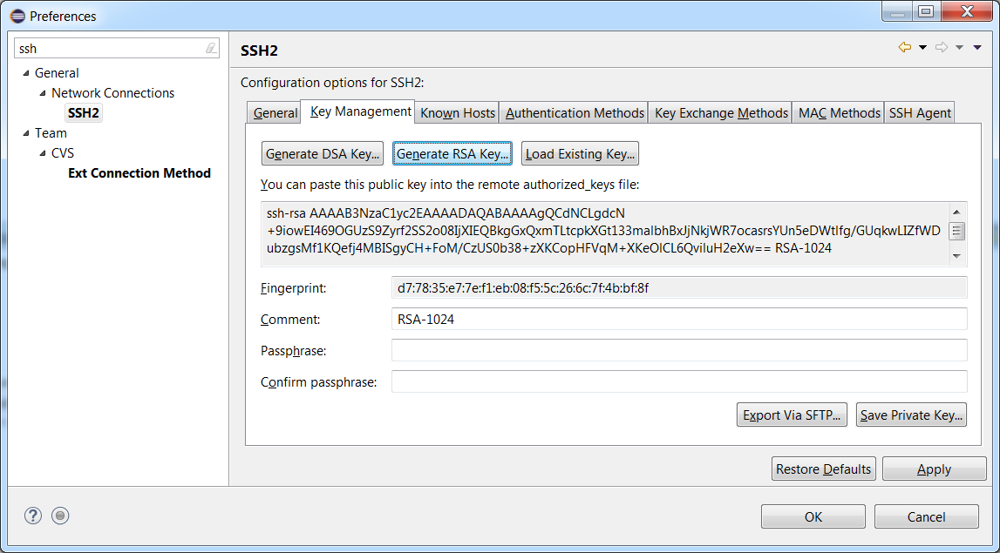

 

Save your private key and your public key with the corresponding buttons. It is preferable to protect your key by adding a pass-phrase to it that will be asked every time you use it as a precaution. You should get two keys by the time this is finished: xxxx.pub (for your public key) and xxxx (for your private one).

 

#### Adding the ssh key

Furthermore your will have to add the ssh key (if you want to commit via ssh) to <b>Preferences>General>Network Connection>SSH2</b> by setting the path to your .ssh folder and adding the name of your key to the private keys list.

As an example here is what this should look like when viewed inside your eclipse's Preferences page:

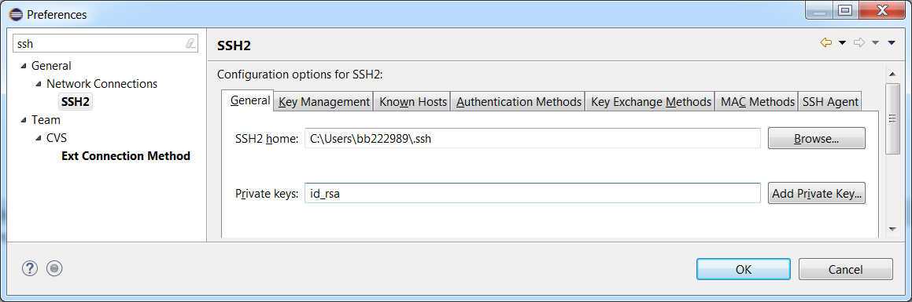

And Add this key to your gerrit account by going into your settings and then <b>SSH Public Keys>Add Key</b> and paste the newly generated public key. It should look like: <b>[algorithm] [key] [comment]</b>, as shown here the first one is of the form: <b>ssh-rsa xxxxxxxxx Generated</b>

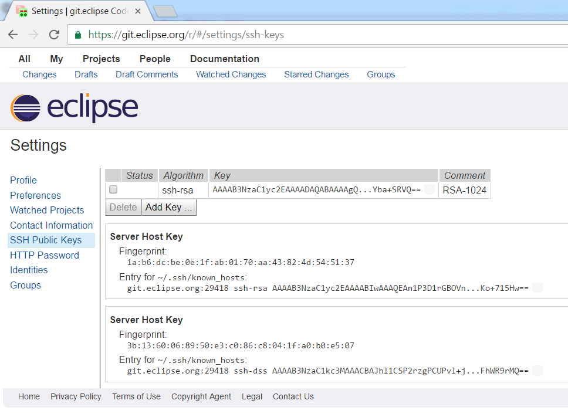

  

### Configure push for Gerrit

Because  you're not an official Eclipse Formal Modeling commiter, you can't just commit your code on the Eclipse Formal Modeling git repository; you have to submit your contribution via the commit refs/for/master branch.

#### Via EGit
You can configure EGit for push on that particular branch:

* On the Git Repositories view, open ''Remotes''
* Add a new Remote by right clicking on ''Remotes'', then choose ''Create Remote...'', and choose a new name (for example Gerrit)
N.B. : you can also choose to modify the origin remote.
* Configure Gerrit for this remote by right clicking on it, and Gerrit Configuration

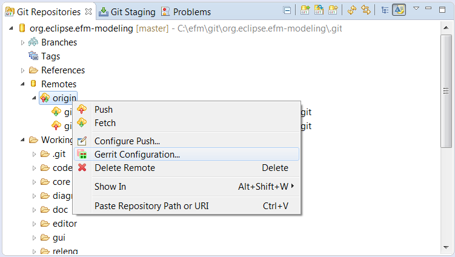

You now have to configure the repository URI :
* Choose your preferred protocole (http, https, ssh)
* Enter the efm-modeling URI :
** via ssh : '''ssh://[committer_id]@git.eclipse.org:29418/efm/org.eclipse.efm-modeling.git''', where [commiter_id] is your Gerrit id.

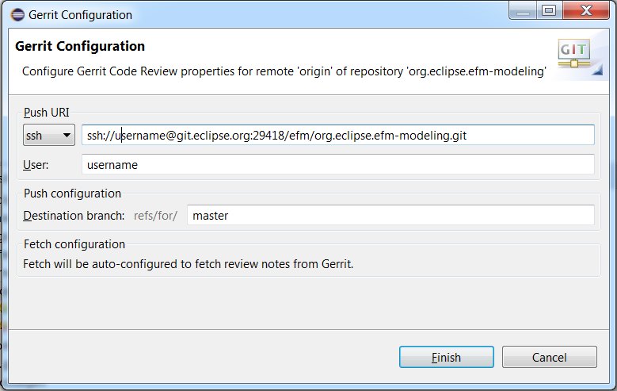

  

* The above push configurations already contain your Gerrit id in the adress, and therefore the Gerrit id field will be updated automatically in the configuration window.
* You may want to enter you password so that you won't have to type it on each push.

If you're experiencing problems, please verify that you're pushing on refs/for/master (Or refs/drafts/master for hidden review)

 

### How to commit using EGit

In order to create, or amend, a commit go to the "Git Staging" View (if need, open that view using the Eclipse menu `Windows->Show View...`) there you will have all the changes detected by EGit (it might be a little messy and full of files you didn't even touch, as is the case in this image, but don't pay it attention as your changes will be there as well) and drag the wanted files from <b> Unstaged Changes </b> to <b> Staged Changes </b>. then edit the commit message:
* The first line of your commit comment should be the bugzilla task number and its name; example : Bug 12345 - The name of the bug you fixed.
* Then should be the fixes you provided
* If it is an amend of a precedent commit be sure to add the Change-Id provided by gerrit (upper left corner of the gerrit page) and separate the Change-Id from the rest of the meassage with a blank line
* You will then have to sign-off your commit

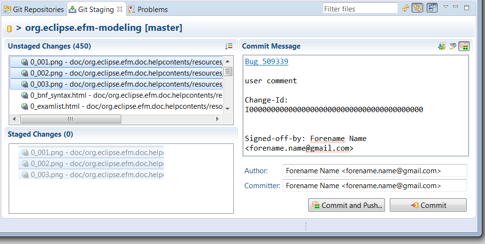

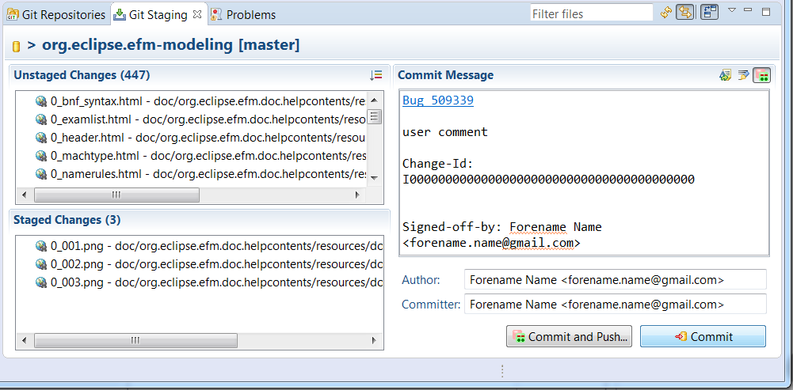

  
Now you need to submit your commit to Gerrit as follows.

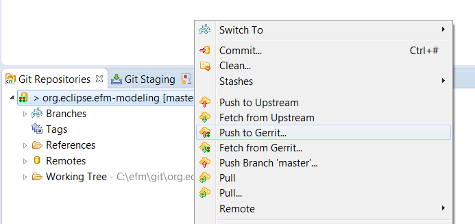

The first commit on a Bug won't have a change-id as this will be created when the commit is pushed and accepted by Gerrit. The change-id can be retrieved by visiting the pushed commit on Gerrit.
With EGit the "amend previous commit" button should fill the new commit's message with the previous fields. It is important to know that the Change-Id must be separated from the commit message by a blank line, so that it will be identified from the rest of the message and your push to gerrit will update the existing one.

#### Once the commit is submitted

Once all this is done, don't forget to link the gerrit page inside a comment in the related Bugzilla page. This little update will make things easier for the users and even serve you as a reminder to close or update the Bugzilla status !

Gerrit & Bugzilla are now synchronized. A reference from Bugzilla to the Gerrit contribution is now automatically added as soon as the contribution is proposed, and another comment is added when the contribution is accepted (merged). Note that this synchronization can only happen if the Contribution contains the Bug ID in the commit message (‘<b>Bug 123456</b>: ....’). Also note that by default, Mylyn/Bugzilla only writes the bug number (Without the ‘Bug’ prefix), which doesn’t trigger the automatic synchronization.

  

You will be able to see your contribution by opening Gerrit's web interface ( `https://git.eclipse.org/r` ). Filters can be applied in the search fieldbox. Useful ones in this case are:
* status:open, that will only show the opened and not yet reviewed commits
* project:efm/org.eclipse.efm-modeling, that will only show commit related to the efm-modeling project

Go to  `https://git.eclipse.org/r -> Changes`, you will find your bug listed. Click on the Bug link in order to assign reviwers (we recommand to assign at least one reviewer among the efm commiters).

Nota. Before pushing on gerrit it is preferable to update your local branch from the remote as that should prevent merge conflicts if your change is accepted and merged.